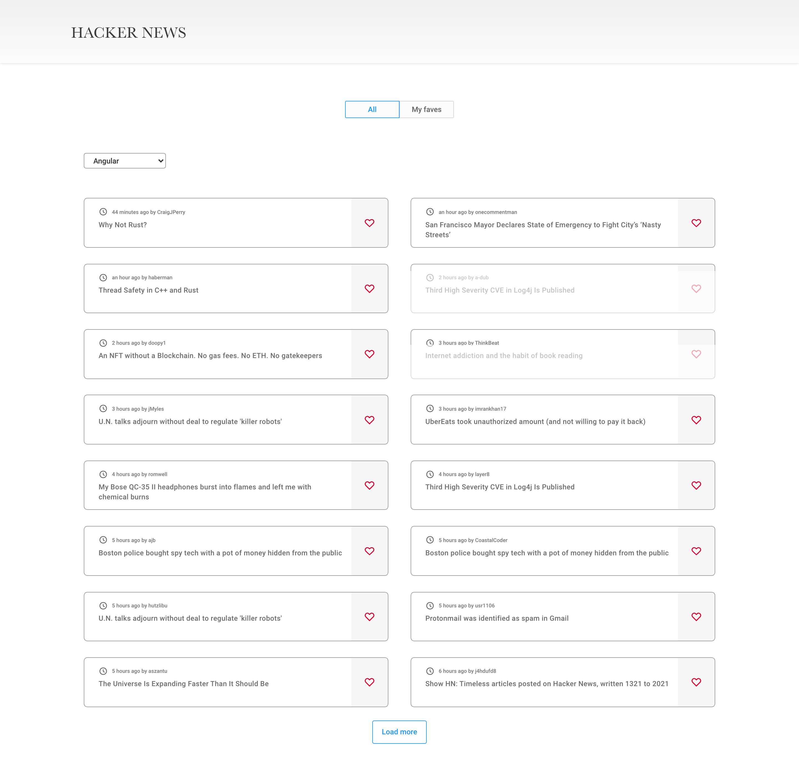

# Project Title

Hacker News - Technical test - Reign

## Table of contents

- [Overview](#overview)
  - [Description](#description)
  - [Demo Link](#demo-link)
  - [Screenshots](#screenshots)
  - [Requeriments](#requeriments)
- [Tools and structure](#tools-and-structure)
  - [Technologies Used](#technologies-used)
  - [Setup](#setup)
  - [Project structure](#project-structure)

## Overview

### Description

A small responsive web application that requests data to the Hackers News public API.

This web application is part of a technical test for [Reign company](https://www.reign.cl/en/).

### Demo Link

[Deployment of the web app on Netlify](https://compassionate-aryabhata-eef162.netlify.app/)

### Screenshots

### Requeriments

- The user will be able to filter the news based on a specific topic selected from the dropdown.
- The user will be able to keep the same filter in the dropdown even after refreshing the page.
- The user will be able to mark any post as a favorite.
- The user will be able to check the favorite posts in the tab "My Faves".
- The user will be able to keep the same favorite posts even after refreshing the page.
- The user will be able to read a complete post by clicking on any part of the post (except on the "like button").
- The user will be able to properly interact with the web application regardless of the viewport size.

## Tools and structure

### Technologies Used

#### Dev stack

- React.js
- Module.css

#### Dependencies

- Classnames
- Day.js

#### Deployment tool

- Netlify

### Setup

- Download or clone the repository
- Run `npm install`
- Run `npm start`
- Open [http://localhost:3000](http://localhost:3000) to view it in your browser.

### Project structure

#### Data Layer

Inside the api folder, the `post.js` file is found. This file contains 3 functions, the `getPosts()` function is in charge of request data from the API, the function `getFavoritePosts()` get the posts that have been marked as favorite from the local storage and, the `markAsFavorite()` merge both data from the API and the local storage.

#### Components

- Header: a presentational component in charge of rendering the header.
- Tabs: a presentational component in charge of rendering the tabs (All / My Faves).
- Dropdown: a component in charge of rendering the dropdown element. Also, this component set the option by default, detects when the option selected have change and update its corresponding state.
- Post: a component in charge of rendering an individual card from each post. Also, this component is in charge of redirect the user to the whole post when the card is clicked, handle when a user marks a post as favorite (or removes this action).

#### Layout

- Main: the `Main.js` file contains both presentational components (header and tabs) so they can be rendered at once when is been called in the pages.

#### Pages

- All: The `All.js` file contains the components that should be render in the All page. Also, is in charge of setting the state of the selected topic in the dropdown, the lists of posts and the page number.
- Favs: The `Favs.js` file contains the logic to render the list of favorite posts.
